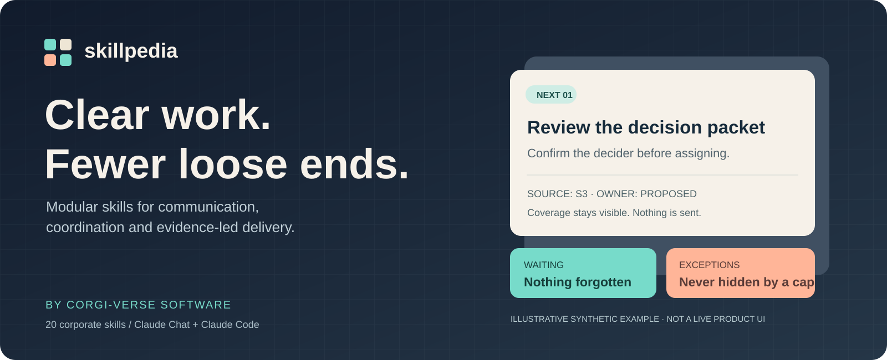
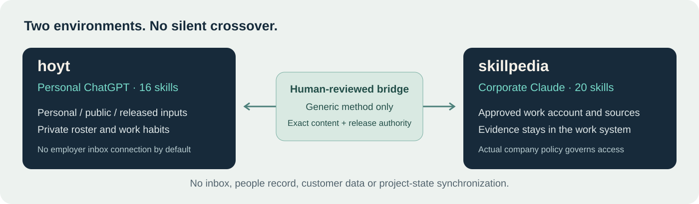
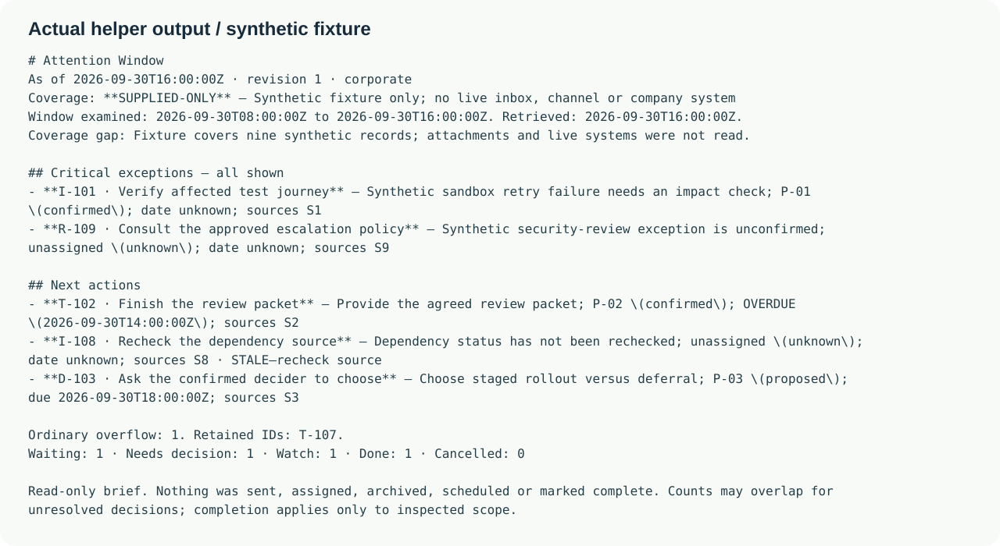

# Skillpedia

**Clear work. Fewer loose ends.** Evidence-led skills for communication,
coordination and complete delivery — by **Corgi-verse Software**.



**v1.0.0 · 20 corporate skills · 16 personal companion skills · MIT**  
**Implemented package; native-host pilot pending.** See [STATUS](STATUS.md) for
exact checks and limits. Independent and offered for authorized evaluation by
Expedia teams; not commissioned, endorsed, company-validated or connected to
Expedia systems. No internal company information was used.

## 1. What it does

Turn an overloaded session into a small next-action window without losing the
rest of the work. Triage selected communications, distinguish requests from
commitments, resolve people carefully, find blockers, prepare decisions and
write clear updates. Research, Project and Masterwork carry an approved task
through evidence-backed completion rather than stopping at advice.

The common loop is **capture -> verify -> organize -> decide -> draft -> confirm**.
At most three ordinary actions appear first; every critical exception remains
visible. Sources, uncertain ownership, missing dates and unread material stay
explicit. Drafting is not sending. Adding a person is not contacting them.

This is a skill package, not a new inbox application or autonomous background
worker. Existing work systems remain authoritative. There is no telemetry,
server, provider key, bundled connector or new paid dependency.

## 2. Requirements and environment

Use an eligible, enabled ChatGPT or Claude Skills surface. Corporate use requires
the approved workplace account, allowed data classes and administrator controls.
Claude Code must already be installed/authorized for its plugin edition. Python
3.11+ is optional for local helpers and required for rebuilding/testing source.
Helpers use only the standard library; native instruction use needs no package
installation. A subscription does not confer application API entitlement.



Hoyt is for personal/public/released material. Work that needs employer messages,
people records or project information belongs in the approved corporate system.
The bridge never mirrors state between accounts. [Security boundaries](SECURITY.md).

## 3. Install

**Unzip the outer carrier first. Upload individual skills, not the collection.**

| Edition | Files to use | Host installation |
|---|---|---|
| Hoyt / personal ChatGPT | `hoyt-chatgpt-UNZIP-FIRST-v1.0.0.zip` -> `UPLOAD_THESE_TO_CHATGPT/` | Skills -> Add -> Upload from your computer |
| Skillpedia / Claude Chat | `skillpedia-claude-UNZIP-FIRST-v1.0.0.zip` -> `UPLOAD_THESE_TO_CLAUDE/` | Customize -> Skills -> + -> Create skill -> Upload a skill |
| Skillpedia / Claude Code | Corporate archive's complete `claude-code-plugin/`, or source `native/claude-code` | Validate, then session-local `--plugin-dir` |

Archives are supplied with the delivery. From this source repository, regenerate
both locally; no API credentials or provider calls are needed:

```sh
python3 tools/build.py
python3 tools/validate.py
python3 -m unittest discover -s tests -v
# Carrier archives and 36 individual skill ZIPs are now in dist/.
```

For a reversible Claude Code test, from this repository:

```sh
claude plugin validate ./native/claude-code
claude --plugin-dir ./native/claude-code
```

Then enter `/skillpedia:start`. The optional local marketplace is `corgi-verse`;
its plugin is `skillpedia`. Full installation, scopes, updating, rollback and
troubleshooting are in [INSTALL](docs/INSTALL.md). Do not bypass a host scan or
administrator restriction to install this package.

## 4. Use it for real work, one task at a time

Start with **start, capture, triage, people and commitments**. Add the other
skills as needed; no skill depends on all the others being installed.

```text
Use hoyt-start. I have 30 minutes. Organize this personal brain dump into
three next actions plus critical exceptions. Do not send or save anything.

Use skillpedia-triage. Read only the selected approved source and interval.
Show coverage, requests, agreed commitments, blockers and suggested replies.
Keep all external systems unchanged.

Use skillpedia-masterwork on this status draft. Preserve facts and caveats,
remove repetition, finish the actual wording, and do not publish it.
```

[All 20 capabilities and the personal subset](docs/CATALOG.md) ·
[Copy-ready starter prompts](docs/STARTER-PROMPTS.md)

### A checkable example, not a claim about a live inbox

The bundled helper can render already-normalized synthetic records. It does
**not** classify messages or fetch Slack/email; those behaviors belong to the
receiving model and approved connectors and need their own evaluation.

```sh
python3 tools/workbench.py brief fixtures/ledger.json \
  --now 2026-09-30T16:00:00Z
```

[Read the exact generated brief](docs/DEMO-BRIEF.md). The text-format illustration
below renders that same output. All events and people are fictional.



## 5. Advanced use and verification

People and commitments are optional private records, not content embedded in a
shared skill. The helper validates records, rejects identity collisions, applies
versioned updates to a new snapshot, and binds bridge exports to the exact reviewed
payload. Its PASS means consistency, not factual truth or authority to disclose.

A single canonical catalog compiles into three native targets with self-contained
references. Code's optional read-only evidence reviewer uses a separate context;
it cannot edit or approve a release. Model effort and delegation stay proportional
to uncertainty and consequences. [Architecture](docs/ARCHITECTURE.md). The [corporate adoption profile](docs/CORPORATE-ADOPTION.md) and optional travel-platform lens support tailoring without inventing company requirements.

Run the [synthetic receiving-host pilot](evals/README.md) before company sources.
Offline tests cover the helper, records and package structure. They do not prove
native skill selection, instruction-following, real connector behavior, company
approval or measured productivity gains. No such outcome is claimed.

[Acceptance checks](docs/ACCEPTANCE.md) · [Compatibility sources, checked 2026-09-30](docs/SOURCES.md) ·
[Provenance](docs/PROVENANCE.md) · [Next-agent entry](docs/NEXT-AGENT.md)

## 6. License, name and support

[MIT license](LICENSE), with express permission for Expedia and its affiliates,
employees and contractors to use and adapt the software under those terms.
That permission does not approve data disclosure or employer-policy bypass.

Skillpedia is the requested working name. An unrelated SkillPedia AI product
exists; plugin status is not trademark clearance. The project uses original
Corgi-verse visuals, no Expedia logo, and makes no affiliation or legal-clearance
claim. [Name and trademark notice](docs/TRADEMARKS.md).

Report reproducible issues without secrets, company messages or personal records.
Keep real work state out of this public repository. Contributions should preserve
security boundaries and include a failing regression case and current evidence.
